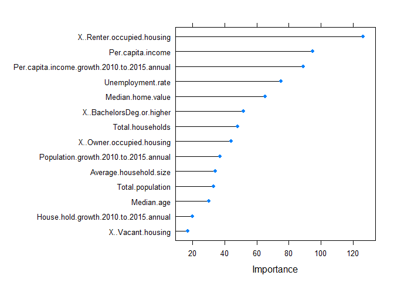

# US 2012 Presidential Election Predictions
Andrew Kinsman  
5 June 2016  


In this task the goal is discover which demographic variables help predict who wins each county in the 2012 US Presidential election. This is a binary classification problem, as there is a dichotomous outcome - either Romney won the seat or Obama did. 

We start by loading the data and tidying up the target variable.


```r
election <- read.csv("USElectionDemographics.csv")
str(election)
```

```
## 'data.frame':	3114 obs. of  25 variables:
##  $ State.Abbr                                  : Factor w/ 51 levels "AK","AL","AR",..: 1 2 2 2 2 2 2 2 2 2 ...
##  $ State.fips.code                             : int  2 1 1 1 1 1 1 1 1 1 ...
##  $ State                                       : Factor w/ 51 levels "Alabama","Alaska",..: 2 1 1 1 1 1 1 1 1 1 ...
##  $ County.fips.code                            : int  2000 1005 1011 1035 1047 1063 1065 1073 1085 1087 ...
##  $ County                                      : Factor w/ 1847 levels "Abbeville County",..: 14 99 223 390 443 681 703 833 994 1009 ...
##  $ State.County                                : Factor w/ 3114 levels "AK Alaska","AL Autauga",..: 1 4 7 19 25 33 34 38 44 45 ...
##  $ Total.population                            : int  695751 28759 10926 13266 42841 9278 18594 662628 12852 22463 ...
##  $ Median.age                                  : num  34.7 37.3 36.2 40.9 37 ...
##  $ X..BachelorsDeg.or.higher                   : num  19.9 13.1 9.5 10.9 16.3 ...
##  $ Unemployment.rate                           : num  10.7 14.3 17 20.9 22.6 ...
##  $ Per.capita.income                           : num  25624 15978 12847 15340 15369 ...
##  $ Total.households                            : int  248724 10447 3749 5624 17046 3802 6764 267862 4869 8506 ...
##  $ Average.household.size                      : num  2.82 2.45 2.48 2.34 2.48 ...
##  $ X..Owner.occupied.housing                   : num  42 58.7 58.7 59.8 54.5 ...
##  $ X..Renter.occupied.housing                  : num  25.8 21.2 20.1 13.9 28.2 ...
##  $ X..Vacant.housing                           : num  32.2 20.1 21.2 26.3 17.2 ...
##  $ Median.home.value                           : num  179330 79052 72014 68596 74130 ...
##  $ Population.growth.2010.to.2015.annual       : num  -0.295 -0.23 -0.77 -0.61 -0.74 ...
##  $ House.hold.growth.2010.to.2015.annual       : num  -0.239 -0.1 -0.75 -0.45 -0.57 ...
##  $ Per.capita.income.growth.2010.to.2015.annual: num  2.63 0.71 1.05 0.73 0.76 ...
##  $ County.Party.Winner                         : Factor w/ 2 levels "Dem","GOP": 2 1 1 1 1 1 1 1 1 1 ...
##  $ County.Winner.Votes                         : int  121234 5873 4058 3551 14599 4514 5401 159658 5747 9045 ...
##  $ County.Total.Votes                          : int  220596 11459 5318 7013 20936 5328 8628 303424 7519 10385 ...
##  $ X..Votes                                    : num  55 51.3 76.3 50.6 69.7 ...
##  $ Winner                                      : Factor w/ 2 levels "Barack Obama",..: 2 1 1 1 1 1 1 1 1 1 ...
```

```r
summary(election)
```

```
##    State.Abbr   State.fips.code      State      County.fips.code
##  TX     : 254   Min.   : 1.00   Texas   : 254   Min.   : 1001   
##  GA     : 159   1st Qu.:19.00   Georgia : 159   1st Qu.:19038   
##  VA     : 134   Median :29.00   Virginia: 134   Median :29208   
##  KY     : 120   Mean   :30.55   Kentucky: 120   Mean   :30649   
##  MO     : 115   3rd Qu.:46.00   Missouri: 115   3rd Qu.:46007   
##  KS     : 105   Max.   :56.00   Kansas  : 105   Max.   :56045   
##  (Other):2227                   (Other) :2227                   
##                County         State.County  Total.population  
##  Washington County:  30   AK Alaska :   1   Min.   :      56  
##  Jefferson County :  25   AL Autauga:   1   1st Qu.:   11377  
##  Franklin County  :  24   AL Baldwin:   1   Median :   26097  
##  Jackson County   :  23   AL Barbour:   1   Mean   :   99940  
##  Lincoln County   :  23   AL Bibb   :   1   3rd Qu.:   67133  
##  Madison County   :  19   AL Blount :   1   Max.   :10240505  
##  (Other)          :2970   (Other)   :3108                     
##    Median.age    X..BachelorsDeg.or.higher Unemployment.rate
##  Min.   :22.10   Min.   : 5.50             Min.   : 0.600   
##  1st Qu.:37.10   1st Qu.:13.40             1st Qu.: 7.300   
##  Median :39.90   Median :17.00             Median : 9.600   
##  Mean   :39.83   Mean   :19.21             Mean   : 9.864   
##  3rd Qu.:42.70   3rd Qu.:22.40             3rd Qu.:12.200   
##  Max.   :57.70   Max.   :68.40             Max.   :36.400   
##                                                             
##  Per.capita.income Total.households  Average.household.size
##  Min.   : 5978     Min.   :     28   Min.   :1.840         
##  1st Qu.:17905     1st Qu.:   4362   1st Qu.:2.370         
##  Median :20134     Median :  10124   Median :2.460         
##  Mean   :21083     Mean   :  37496   Mean   :2.496         
##  3rd Qu.:22972     3rd Qu.:  25911   3rd Qu.:2.580         
##  Max.   :57356     Max.   :3292577   Max.   :4.280         
##                                                            
##  X..Owner.occupied.housing X..Renter.occupied.housing X..Vacant.housing
##  Min.   :15.00             Min.   : 3.90              Min.   : 2.60    
##  1st Qu.:55.80             1st Qu.:17.30              1st Qu.:10.70    
##  Median :61.50             Median :20.70              Median :15.00    
##  Mean   :60.39             Mean   :21.93              Mean   :17.68    
##  3rd Qu.:66.30             3rd Qu.:25.20              3rd Qu.:21.70    
##  Max.   :83.80             Max.   :74.20              Max.   :77.60    
##                                                                        
##  Median.home.value Population.growth.2010.to.2015.annual
##  Min.   :  18750   Min.   :-2.540                       
##  1st Qu.:  78137   1st Qu.:-0.350                       
##  Median :  99862   Median : 0.080                       
##  Mean   : 118756   Mean   : 0.247                       
##  3rd Qu.: 133907   3rd Qu.: 0.650                       
##  Max.   :1000001   Max.   : 6.640                       
##                                                         
##  House.hold.growth.2010.to.2015.annual
##  Min.   :-2.4100                      
##  1st Qu.:-0.2600                      
##  Median : 0.1600                      
##  Mean   : 0.3321                      
##  3rd Qu.: 0.7500                      
##  Max.   : 6.8000                      
##                                       
##  Per.capita.income.growth.2010.to.2015.annual County.Party.Winner
##  Min.   :0.030                                Dem: 686           
##  1st Qu.:1.580                                GOP:2428           
##  Median :2.100                                                   
##  Mean   :1.995                                                   
##  3rd Qu.:2.540                                                   
##  Max.   :4.180                                                   
##                                                                  
##  County.Winner.Votes County.Total.Votes    X..Votes    
##  Min.   :     54     Min.   :     64    Min.   :47.82  
##  1st Qu.:   3088     1st Qu.:   4759    1st Qu.:56.24  
##  Median :   6833     Median :  10732    Median :63.20  
##  Mean   :  24247     Mean   :  39552    Mean   :64.39  
##  3rd Qu.:  17230     3rd Qu.:  27641    3rd Qu.:71.39  
##  Max.   :1672164     Max.   :2427869    Max.   :95.86  
##                                                        
##           Winner    
##  Barack Obama: 686  
##  Mitt Romney :2428  
##                     
##                     
##                     
##                     
## 
```

```r
levels(election$Winner) <- c("Obama", "Romney")
table(election$Winner)
```

```
## 
##  Obama Romney 
##    686   2428
```

Of course, it is common knowledge that Obama won this election, so at first it appears surprising that he won so few counties. In fact, although Romney won far more counties than Obama, these were located mainly in the more sparsely populated rural areas - Romney was swamped by Obama's huge popularity in heavily populated urban areas.

Here we begin the modelling process by splitting the data into training and validation sets. We shall develop each model using the training data and then test its predictive performance using the validation set.


```r
library(caTools)
set.seed(180)
split <- sample.split(election$Winner, SplitRatio = 0.7) # split using target variable as base
train.elect <- subset(election, split == TRUE)
val.elect <- subset(election, split == FALSE)
```

Now we can establish a baseline with which to compare the modelling results.


```r
table(val.elect$Winner) 
```

```
## 
##  Obama Romney 
##    206    728
```

```r
206/nrow(val.elect) 
```

```
## [1] 0.2205567
```
Obama only won 22.1% of these counties

## First model - Logistic regression

Logistic regression is very commonly used in binary classification problems. A "logit" model uses one or more predictor variables to estimate the probability of a binary response. We therefore start by building stepwise logistic regression model using the 14 demographic characteristics.


```r
library(caret)
```

```
## Loading required package: lattice
```

```
## Loading required package: ggplot2
```

```r
train_control <- trainControl(method="repeatedcv", number=10, repeats=3)
set.seed(180)
logmod1 <- train(Winner~.-State.Abbr -State.fips.code -State -County.fips.code -County -State.County 
                   -County.Party.Winner -County.Winner.Votes -County.Total.Votes -X..Votes, 
                   data=train.elect, trControl=train_control, method="glmStepAIC", family="binomial", trace=0)
```

```
## Loading required package: MASS
```

```r
summary(logmod1) 
```

```
## 
## Call:
## NULL
## 
## Deviance Residuals: 
##     Min       1Q   Median       3Q      Max  
## -2.8471   0.1721   0.3706   0.5701   3.6058  
## 
## Coefficients:
##                                                Estimate Std. Error z value
## (Intercept)                                   2.202e+00  2.149e+00   1.025
## Total.population                              1.616e-05  3.652e-06   4.426
## Median.age                                    4.149e-02  2.870e-02   1.446
## X..BachelorsDeg.or.higher                    -8.807e-02  1.667e-02  -5.282
## Unemployment.rate                            -1.695e-01  1.820e-02  -9.312
## Per.capita.income                             9.934e-05  2.924e-05   3.397
## Total.households                             -4.857e-05  1.031e-05  -4.710
## Average.household.size                       -1.047e+00  5.652e-01  -1.853
## X..Owner.occupied.housing                     6.273e-02  1.552e-02   4.041
## X..Vacant.housing                             3.918e-02  1.295e-02   3.025
## Median.home.value                            -1.051e-05  1.912e-06  -5.494
## Population.growth.2010.to.2015.annual         5.109e+00  1.018e+00   5.018
## House.hold.growth.2010.to.2015.annual        -4.180e+00  1.003e+00  -4.170
## Per.capita.income.growth.2010.to.2015.annual -5.840e-01  1.012e-01  -5.770
##                                              Pr(>|z|)    
## (Intercept)                                   0.30533    
## Total.population                             9.59e-06 ***
## Median.age                                    0.14826    
## X..BachelorsDeg.or.higher                    1.28e-07 ***
## Unemployment.rate                             < 2e-16 ***
## Per.capita.income                             0.00068 ***
## Total.households                             2.48e-06 ***
## Average.household.size                        0.06387 .  
## X..Owner.occupied.housing                    5.32e-05 ***
## X..Vacant.housing                             0.00249 ** 
## Median.home.value                            3.93e-08 ***
## Population.growth.2010.to.2015.annual        5.23e-07 ***
## House.hold.growth.2010.to.2015.annual        3.05e-05 ***
## Per.capita.income.growth.2010.to.2015.annual 7.91e-09 ***
## ---
## Signif. codes:  0 '***' 0.001 '**' 0.01 '*' 0.05 '.' 0.1 ' ' 1
## 
## (Dispersion parameter for binomial family taken to be 1)
## 
##     Null deviance: 2298.3  on 2179  degrees of freedom
## Residual deviance: 1595.2  on 2166  degrees of freedom
## AIC: 1623.2
## 
## Number of Fisher Scoring iterations: 5
```

Here stepwise logistic regression (using the Akaike Information Criterion) eliminated just one of the 14 variables - percentage in rented occupied housing.

Now we test this stepwise logistic regression model on the validation set.


```r
predicted_Log <- predict(logmod1, type="raw", newdata=val.elect)
summary(predicted_Log)
```

```
##  Obama Romney 
##    102    832
```

```r
102/nrow(val.elect) # 0.109 - substantial under-representation of Obama's actual winss
```

```
## [1] 0.1092077
```

```r
log1Table <- table(val.elect$Winner, predicted_Log, dnn=c("Actual", "Predicted"))
log1Table
```

```
##         Predicted
## Actual   Obama Romney
##   Obama     87    119
##   Romney    15    713
```

```r
# Assess model performance using function from R in Action (Kabacoff, 2015) p.406.
model_performance <- function(table, n=5){
        if(!all(dim(table) == c(2,2)))
                stop("Must be a 2 x 2 table")
        tn = table[1,1]
        fp = table[1,2]
        fn = table[2,1]
        tp = table[2,2]
        sensitivity = tp/(tp+fn)
        specificity = tn/(tn+fp)
        ppp = tp/(tp+fp)
        npp = tn/(tn+fn)
        hitrate = (tp+tn)/(tp+tn+fp+fn)
        result <- paste("Sensitivity = ", round(sensitivity, n) ,
                        "\nSpecificity = ", round(specificity, n),
                        "\nPositive Predictive Value = ", round(ppp, n),
                        "\nNegative Predictive Value = ", round(npp, n),
                        "\nAccuracy = ", round(hitrate, n), "\n", sep="")
        cat(result)
}

model_performance(log1Table) 
```

```
## Sensitivity = 0.9794
## Specificity = 0.42233
## Positive Predictive Value = 0.85697
## Negative Predictive Value = 0.85294
## Accuracy = 0.85653
```

This model has a 0.857 accuracy, predicting 85.7% of county elections correctly. However, it should be remembered that Obama only won 22.1% of these seats, so this apparently excellent accuracy is somewhat distorted by the imbalance among the outcomes. A more robust metric for comparing models (particularly in cases of unbalanced datasets, such as here) is the area under the ROC (receiver operator characteristic) curve or "AUC".


```r
library(ROCR)
```

```
## Loading required package: gplots
```

```
## 
## Attaching package: 'gplots'
```

```
## The following object is masked from 'package:stats':
## 
##     lowess
```

```r
predicted_Log2 <- predict(logmod1, type="prob", newdata=val.elect)
ROCRLog <- prediction(predicted_Log2[,2], val.elect$Winner)
aucLog <- as.numeric(performance(ROCRLog, "auc")@y.values)
aucLog # 0.8443401
```

```
## [1] 0.8443401
```

```r
# Plot accuracy vs. threshold
plot(performance(ROCRLog, measure = "acc"), col="purple", xlab="Threshold", main=
             "Logit Model Accuracy \nfor Different Thresholds") 
axis(1, at=c(0.1, 0.3, 0.5, 0.7, 0.9))
axis(2, at=c(0.1, 0.3, 0.5, 0.7, 0.9)) # best accuracy is around 0.5 so no need to adjust threshold
```

<!-- -->

```r
# Prepare ROC performance for subsequent ROC curve plot
perf_Log <- performance(ROCRLog, "tpr", "tnr")
```

The logistic regression model has an AUC of 0.844, which can be considered the AUC benchmark by which other models will be judged.

## Second model - Linear discriminant analysis with repeated cross-validation

The second model uses linear discriminant analysis, which attempts to find a linear combination of variables that separates the two classes (i.e. Obama vs. Romney).


```r
train_control <- trainControl(method="repeatedcv", number=10, repeats=3)
set.seed(180)
lda_model <- train(Winner~.-State.Abbr -State.fips.code -State -County.fips.code -County -State.County 
                   -County.Party.Winner -County.Winner.Votes -County.Total.Votes -X..Votes, 
                   data=train.elect, trControl=train_control, method="lda")
# Display results
lda_model 
```

```
## Linear Discriminant Analysis 
## 
## 2180 samples
##   24 predictor
##    2 classes: 'Obama', 'Romney' 
## 
## No pre-processing
## Resampling: Cross-Validated (10 fold, repeated 3 times) 
## Summary of sample sizes: 1962, 1962, 1962, 1962, 1962, 1962, ... 
## Resampling results:
## 
##   Accuracy   Kappa   
##   0.8463303  0.467317
```

```r
# Make predictions
predicted_LDA <- predict(lda_model, newdata=val.elect, type="raw")
summary(predicted_LDA)
```

```
##  Obama Romney 
##     99    835
```

```r
99/nrow(val.elect) # 0.106 - very large under-representation of Obama wins
```

```
## [1] 0.1059957
```

```r
LDATable <- table(val.elect$Winner, predicted_LDA, dnn=c("Actual", "Predicted"))
LDATable
```

```
##         Predicted
## Actual   Obama Romney
##   Obama     85    121
##   Romney    14    714
```

```r
model_performance(LDATable) 
```

```
## Sensitivity = 0.98077
## Specificity = 0.41262
## Positive Predictive Value = 0.85509
## Negative Predictive Value = 0.85859
## Accuracy = 0.85546
```

The LDA model has 85.55% accuracy, very slightly worse than logistic regression.


```r
library(pROC)
```

```
## Type 'citation("pROC")' for a citation.
```

```
## 
## Attaching package: 'pROC'
```

```
## The following objects are masked from 'package:stats':
## 
##     cov, smooth, var
```

```r
LDA_predictions2 <- predict(lda_model, val.elect, type="prob")
LDA_predictions_prob <- LDA_predictions2[,2]
LDA_ROC <- roc(predictor=LDA_predictions_prob,
              response=val.elect$Winner,
              levels=c("Obama", "Romney"))
LDA_ROC # AUC of 0.8409
```

```
## 
## Call:
## roc.default(response = val.elect$Winner, predictor = LDA_predictions_prob,     levels = c("Obama", "Romney"))
## 
## Data: LDA_predictions_prob in 206 controls (val.elect$Winner Obama) < 728 cases (val.elect$Winner Romney).
## Area under the curve: 0.8409
```

The AUC of the LDA model is 0.841, again slightly worse than logistic regression. Thus the linear discriminant model has not outperformed logistic regression.

## Third model - Random forest model with three-fold cross-validation

Another popular classification approach is decision trees. However, these are often prone to overfitting as they don't always discriminate well between genuine "signal" and random "noise". A more robust means of impementing decision trees is a random forest model, whereby many decision trees are generated from different parts of the dataset, and these trees are then averaged. This averaging process produces results that are less prone to overfitting.  

Cross-validation was employed in order to obtain a reliable estimate of the model's predictive accuracy for unseen data. Repeated 10-fold cross-validation was attempted but abandoned, as it was computationally demanding and took too long to run, so a three-fold cross-validation was used instead.


```r
rfControl <- trainControl(method="cv", number=3, returnResamp="none", 
                          summaryFunction = twoClassSummary, classProbs = TRUE)
set.seed(180)
rf_model <- train(Winner ~.-State.Abbr -State.fips.code -State -County.fips.code -County -State.County 
            -County.Party.Winner -County.Winner.Votes -County.Total.Votes -X..Votes, 
            data=train.elect,
            method="rf", 
            trControl=rfControl,           
            metric = "ROC",
            preProc = c("center", "scale"))
```

```
## Loading required package: randomForest
```

```
## randomForest 4.6-12
```

```
## Type rfNews() to see new features/changes/bug fixes.
```

```
## 
## Attaching package: 'randomForest'
```

```
## The following object is masked from 'package:ggplot2':
## 
##     margin
```

```r
plot(varImp(rf_model, scale=F)) 
```

<!-- -->

Here the percentage of renter occupied housing is the most important variable (which is interesting given that the logit model omitted this variable entirely), followed by per capita income.


```r
# Evaluate random forest model
rf_predictions <- predict(rf_model, val.elect, type="raw")
postResample(rf_predictions, val.elect$Winner) 
```

```
##  Accuracy     Kappa 
## 0.8554604 0.4921010
```

```r
rfTable <- table(rf_predictions, val.elect$Winner, dnn=c("Actual", "Predicted")) 
rfTable
```

```
##         Predicted
## Actual   Obama Romney
##   Obama     89     18
##   Romney   117    710
```

```r
model_performance(rfTable) 
```

```
## Sensitivity = 0.85852
## Specificity = 0.83178
## Positive Predictive Value = 0.97527
## Negative Predictive Value = 0.43204
## Accuracy = 0.85546
```

The random forest model has 85.55% accuracy, very slightly worse than the logistic regression model.


```r
# Proportion of predictions that were predicted Obama
(89+117)/nrow(val.elect) # 0.221 - very good representation of actual cases
```

```
## [1] 0.2205567
```

```r
# Now look at probabilities:
library(pROC)
rf_predictions2 <- predict(rf_model, val.elect, type="prob")
rf_predictions_prob <- rf_predictions2[,2]
rf_ROC <- roc(predictor=rf_predictions_prob,
              response=val.elect$Winner,
              levels=c("Obama", "Romney"))
rf_ROC # AUC is 0.852, slightly better than logistic regression
```

```
## 
## Call:
## roc.default(response = val.elect$Winner, predictor = rf_predictions_prob,     levels = c("Obama", "Romney"))
## 
## Data: rf_predictions_prob in 206 controls (val.elect$Winner Obama) < 728 cases (val.elect$Winner Romney).
## Area under the curve: 0.854
```
However, the AUC of the random forest model is 0.854, slightly better than logistic regression.

## Fourth model - Gradient boosting model with 3-fold cross-validation

The final model we shall consider is a form of stochastic gradient boosting (from the generalised boosted model or "GBM" package in R). Like the random forest approach this is a non-linear model that builds ensembles of (usually) decision trees.

One of the main advantages of this type of approach is that (unlike a linear model), the model may be able to capture non-linear interactions between the explanatory variables and the target. The "boosted" component means that the algorithm is giving proportionately more weight to the hard to classify observations.


```r
library(class)
library(e1071)
library(pROC)
library(gbm)
```

```
## Loading required package: survival
```

```
## 
## Attaching package: 'survival'
```

```
## The following object is masked from 'package:caret':
## 
##     cluster
```

```
## Loading required package: splines
```

```
## Loading required package: parallel
```

```
## Loaded gbm 2.1.3
```

```r
gbmControl <- trainControl(method='cv', number=3, returnResamp='none', 
                           summaryFunction = twoClassSummary, classProbs = TRUE)
set.seed(180)
gbm_model <- train(Winner ~.-State.Abbr -State.fips.code -State -County.fips.code -County -State.County 
             -County.Party.Winner -County.Winner.Votes -County.Total.Votes -X..Votes, 
             data=train.elect,
             method="gbm", 
             trControl=gbmControl,           
             metric = "ROC",
             preProc = c("center", "scale"), verbose = FALSE)
```

```
## Loading required package: plyr
```

```r
summary(gbm_model) # which variables were most important to the model?
```

<!-- -->

```
##                                                                                       var
## X..Renter.occupied.housing                                     X..Renter.occupied.housing
## Per.capita.income                                                       Per.capita.income
## Per.capita.income.growth.2010.to.2015.annual Per.capita.income.growth.2010.to.2015.annual
## Unemployment.rate                                                       Unemployment.rate
## Median.home.value                                                       Median.home.value
## X..BachelorsDeg.or.higher                                       X..BachelorsDeg.or.higher
## Total.households                                                         Total.households
## X..Owner.occupied.housing                                       X..Owner.occupied.housing
## Population.growth.2010.to.2015.annual               Population.growth.2010.to.2015.annual
## Average.household.size                                             Average.household.size
## Total.population                                                         Total.population
## Median.age                                                                     Median.age
## House.hold.growth.2010.to.2015.annual               House.hold.growth.2010.to.2015.annual
## X..Vacant.housing                                                       X..Vacant.housing
##                                                rel.inf
## X..Renter.occupied.housing                   16.525716
## Per.capita.income                            12.417030
## Per.capita.income.growth.2010.to.2015.annual 11.647327
## Unemployment.rate                             9.812638
## Median.home.value                             8.537088
## X..BachelorsDeg.or.higher                     6.749410
## Total.households                              6.273759
## X..Owner.occupied.housing                     5.729240
## Population.growth.2010.to.2015.annual         4.846600
## Average.household.size                        4.438767
## Total.population                              4.307223
## Median.age                                    3.917136
## House.hold.growth.2010.to.2015.annual         2.609194
## X..Vacant.housing                             2.188870
```

```r
plot(varImp(gbm_model,scale=F)) 
```

<!-- -->

Exactly as with the random forest model, the percentage of renter occupied housing is the most important variable followed by per capita income.


```r
ggplot(gbm_model) # plots ROC vs. boosting iterations of the three training models
```

```
## Warning: Ignoring unknown aesthetics: shape
```

<!-- -->

```r
# Evaluate GBM
val.elect$gbm_predictions <- predict(gbm_model, val.elect, type="raw") 
postResample(val.elect$gbm_predictions, val.elect$Winner) # 0.8501071 accuracy 
```

```
##  Accuracy     Kappa 
## 0.8501071 0.4955636
```

```r
gbmTable <- table(val.elect$gbm_predictions, val.elect$Winner, dnn=c("Actual", "Predicted")) 
gbmTable 
```

```
##         Predicted
## Actual   Obama Romney
##   Obama     97     31
##   Romney   109    697
```

```r
model_performance(gbmTable) 
```

```
## Sensitivity = 0.86476
## Specificity = 0.75781
## Positive Predictive Value = 0.95742
## Negative Predictive Value = 0.47087
## Accuracy = 0.85011
```

The GBM model has only 85.01% accuracy, worse than the other three models.


```r
# Percentage of predictions that were predicted Obama
(97+109)/nrow(val.elect) # 0.221 - good representation of Obama wins
```

```
## [1] 0.2205567
```

```r
# Now look at probabilities:
gbm_predictions <- predict(object=gbm_model, val.elect, type="prob")
gbm_predictions_prob <- gbm_predictions[,2]
gbm_ROC <- roc(predictor=gbm_predictions_prob,
               response=val.elect$Winner,
               levels=c("Obama", "Romney"))
gbm_ROC #  AUC is 0.85
```

```
## 
## Call:
## roc.default(response = val.elect$Winner, predictor = gbm_predictions_prob,     levels = c("Obama", "Romney"))
## 
## Data: gbm_predictions_prob in 206 controls (val.elect$Winner Obama) < 728 cases (val.elect$Winner Romney).
## Area under the curve: 0.85
```

However, the AUC is 0.850, second-best after random forest.

We can now plot the ROC curves for all four models in order to compare them.


```r
# Plot ROC curves
plot(perf_Log, main="ROC Curves", col = "blue", lty=2)
plot(LDA_ROC, add=TRUE, col = "purple", lty=4)
plot(rf_ROC, add=TRUE, col = "red", lty=1)
plot(gbm_ROC, add=TRUE, col = "green", lty=3)
legend("bottomleft", legend=c("Logit", "LDA", "Random Forest", "GBM"),
       col=c("blue", "purple", "red", "green"), lty=c(2, 4, 1, 3), lwd=2) 
```

<!-- -->

All four ROC curves are very similar, but we can still observe that the random forest (red line) and GBM models (green dots) are slightly better.

## Model Ensemble

Very often an improvement in performance can be achieved by creating an ensemble of models, with each of the models capturing different aspects of the data. Here we create a basic ensemble, averaging all four models:


```r
predictions_ensemble1 <- (predicted_Log2[,2] + LDA_predictions_prob + gbm_predictions_prob + rf_predictions_prob)/4
ensemble1_ROC <- roc(predictor=predictions_ensemble1,
               response=val.elect$Winner,
               levels=c("Obama", "Romney"))
ensemble1_ROC 
```

```
## 
## Call:
## roc.default(response = val.elect$Winner, predictor = predictions_ensemble1,     levels = c("Obama", "Romney"))
## 
## Data: predictions_ensemble1 in 206 controls (val.elect$Winner Obama) < 728 cases (val.elect$Winner Romney).
## Area under the curve: 0.8625
```

```r
# Remove logistic regression from ensemble
predictions_ensemble2 <- (LDA_predictions_prob + gbm_predictions_prob + rf_predictions_prob)/3
ensemble2_ROC <- roc(predictor=predictions_ensemble2,
                     response=val.elect$Winner,
                     levels=c("Obama", "Romney"))
ensemble2_ROC 
```

```
## 
## Call:
## roc.default(response = val.elect$Winner, predictor = predictions_ensemble2,     levels = c("Obama", "Romney"))
## 
## Data: predictions_ensemble2 in 206 controls (val.elect$Winner Obama) < 728 cases (val.elect$Winner Romney).
## Area under the curve: 0.8625
```

```r
# Remove LDA from ensemble
predictions_ensemble3 <- (predicted_Log2[,2] + gbm_predictions_prob + rf_predictions_prob)/3
ensemble3_ROC <- roc(predictor=predictions_ensemble3,
                     response=val.elect$Winner,
                     levels=c("Obama", "Romney"))
ensemble3_ROC 
```

```
## 
## Call:
## roc.default(response = val.elect$Winner, predictor = predictions_ensemble3,     levels = c("Obama", "Romney"))
## 
## Data: predictions_ensemble3 in 206 controls (val.elect$Winner Obama) < 728 cases (val.elect$Winner Romney).
## Area under the curve: 0.863
```

```r
# Retain just random forest and GBM
predictions_ensemble4 <- (gbm_predictions_prob + rf_predictions_prob)/2
ensemble4_ROC <- roc(predictor=predictions_ensemble4,
                     response=val.elect$Winner,
                     levels=c("Obama", "Romney"))
ensemble4_ROC 
```

```
## 
## Call:
## roc.default(response = val.elect$Winner, predictor = predictions_ensemble4,     levels = c("Obama", "Romney"))
## 
## Data: predictions_ensemble4 in 206 controls (val.elect$Winner Obama) < 728 cases (val.elect$Winner Romney).
## Area under the curve: 0.8566
```

```r
# Retain just random forest and logistic regression
predictions_ensemble5 <- (predicted_Log2[,2] + rf_predictions_prob)/2
ensemble5_ROC <- roc(predictor=predictions_ensemble5,
                     response=val.elect$Winner,
                     levels=c("Obama", "Romney"))
ensemble5_ROC 
```

```
## 
## Call:
## roc.default(response = val.elect$Winner, predictor = predictions_ensemble5,     levels = c("Obama", "Romney"))
## 
## Data: predictions_ensemble5 in 206 controls (val.elect$Winner Obama) < 728 cases (val.elect$Winner Romney).
## Area under the curve: 0.8653
```
The final ensemble (without LDA and GBM) seems to give the best predictions (measured by AUC), but each of these five ensembles is superior to all of the individual models. This demonstrates the power of ensemble modelling - each model is typically able to pick up slightly different characteristics of the data, and when these models are combined they are often able to make better predictions than the individual models by themselves. In this instance the fifth ensemble was able to improve upon the predictions of all the single models by over 1%.

The fact that cross-validation was used to build each of these models makes these predictions reliable, and by using an ensemble rather than just a single model the predictions are made even more robust.

## Summary

The goal here was to produce a classification model that not only was able to predict the winners of the county elections in the 2012 US Presidential race, but also to provide insight into what are the most important demographic predictors of how people vote. Four models were tried and each performed at around 85% accuracy. However, when the models were combined in ensembles they performed better than the single models, with the best ensemble achieving an AUC of 0.865.

Two of the models (random forest and GBM) agreed that the most important variable in determining whether a county would go to Obama or Romney was the percentage of renter occupied housing, followed by per capita income. However, strangely enough the stepwise logistic regression model rejected the percentage of renter occupied housing as a useful predictor. It seems possible that there may be important non-linear interactions between that variable and other variables that the logit model is unable to identify.
